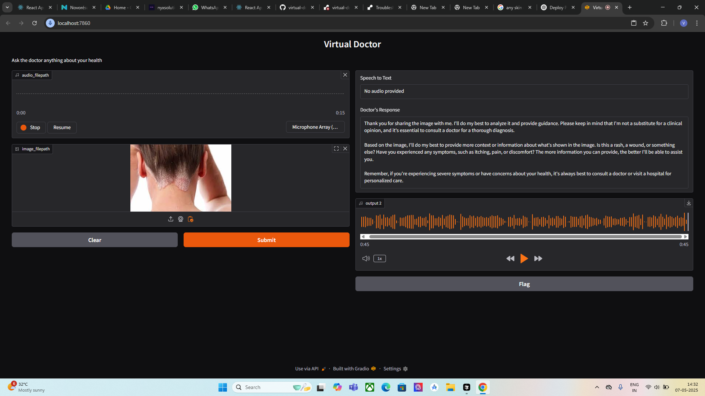

# Virtual Doctor

A healthcare AI application that processes voice inputs, analyzes medical images, and provides health guidance with text-to-speech responses.

## Features

- **Speech-to-Text**: Converts patient voice queries to text using Whisper model
- **Image Analysis**: Examines medical images for potential issues using LLaVA vision models
- **Text Response**: Provides medically-informed guidance (non-diagnostic)
- **Voice Response**: Converts text responses to natural speech using ElevenLabs

## Setup

1. Clone the repository
2. Install dependencies: `pip install -r requirements.txt`
3. Create a `.env` file with your API keys (see `.env.example`)
4. Run the application: `python app.py`

## API Keys Required

- GROQ API key for speech-to-text and text generation
- ElevenLabs API key for text-to-speech

## Deployment

This application can be deployed on platforms like Render for web access.

## Limitations

This application is not a replacement for professional medical advice. It should be used for informational purposes only. 